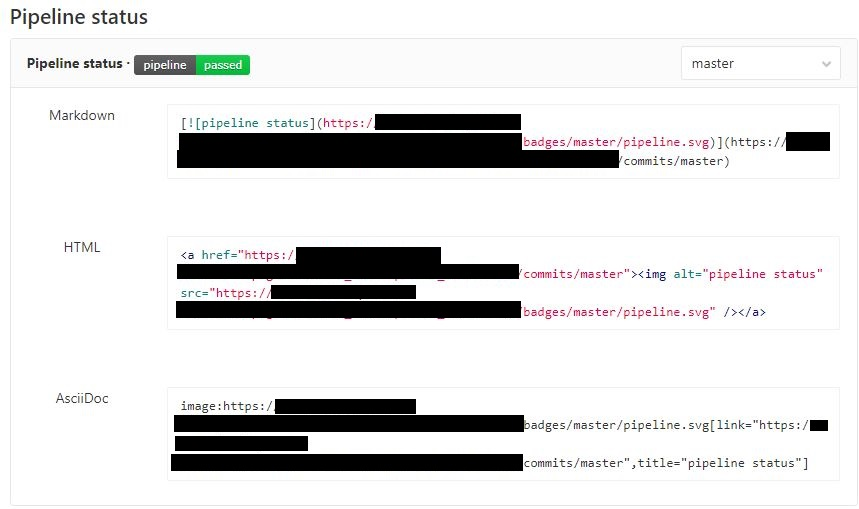
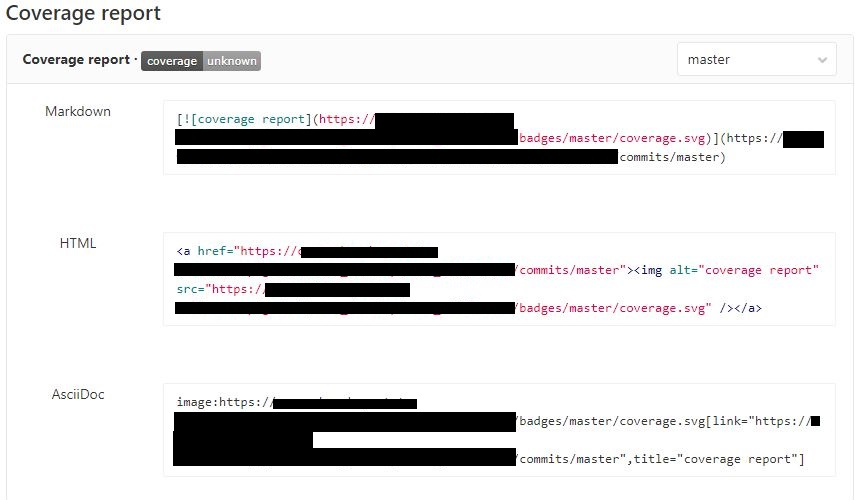
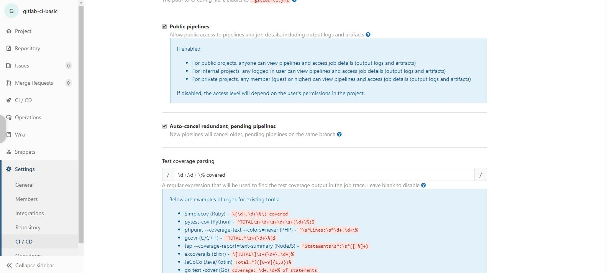

## gitlab-ci-basic  
  
[](https://GITLAB_DOMAIN/gitlab/USERNAME/REPO/commits/master)  
  
[](https://GITLAB_DOMAIN/gitlab/USERNAME/REPO/commits/master)  
  
  
# Introduction  
This repository contains the basic gitlab pipeline file the is used to generate both pipeline status and coverage report as badges.  
It is also contains basic java maven project but the concept is the same for any other project.  
After searching, I found (please correct me if I am wrong) that gitlab pipeline status is easy to implement but the coverage report was not.  
Gitlab search in the console of the pipeline stages to get the coverage, so you should use regex to export the coverage, for example: this repo generate the following lines:  
  
````  
.................  
15 / 15  > instructions covered  
100 % covered  
..................  
````  
  
so that gitlab should be configured to search for `` 100 ``  
  
----------------  
## How to config and run  
1. First of all, you should have a gitlab account :)   
2. clone the repo to   

```sh 
$ git clone https://github.com/daoudsh/gitlab-ci-basic.git  
```  

3. change the remote url to your repo   
```sh 
$ git remote set-url origin YOUR-GITLAB-URL-REPO  
``` 
4. change the badges according to your repo: gitlab -> YOUR-REPO -> Settings -> CI / CD -> General pipelines

	
	
5. configure gitlab to search for the coverage status: gitlab -> YOUR-REPO -> Settings -> CI / CD -> General pipelines

6. push the changes
```sh   
$ git push  
``` 